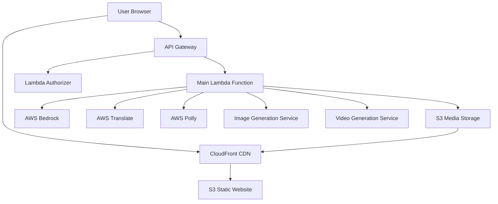

# Design Document: LocalBrandAI

## Overview

LocalBrandAI is a browser-based web application that transforms rough user input from small Indian business owners into professional, multi-format marketing content. The system leverages AWS AI services to provide grammar correction, language translation, and multi-media content generation through a simple, mobile-first interface.

The application follows a serverless architecture using AWS Lambda functions orchestrated through API Gateway, with AI processing handled by AWS Bedrock, Translate, and Polly services. The frontend is a responsive single-page application that works across all major browsers and devices without requiring installation.

## Architecture

### High-Level Architecture



### System Components

**Frontend Layer:**
- Single-page React application served from S3 via CloudFront
- Responsive design optimized for mobile-first usage
- Progressive enhancement for different device capabilities

**API Layer:**
- AWS API Gateway handling HTTP requests
- Lambda functions for business logic processing
- Serverless architecture for automatic scaling

**AI Processing Layer:**
- AWS Bedrock for content enhancement and generation
- AWS Translate for multi-language support
- AWS Polly for text-to-speech conversion
- Third-party services for image and video generation

**Storage Layer:**
- S3 for static website hosting and media file storage
- CloudFront for global content delivery

## Components and Interfaces

### Frontend Components

**InputForm Component:**
```typescript
interface BusinessInput {
  businessType: BusinessType;
  roughMessage: string;
  preferredLanguage: SupportedLanguage;
}

interface InputFormProps {
  onSubmit: (input: BusinessInput) => void;
  isLoading: boolean;
}
```

**ContentDisplay Component:**
```typescript
interface GeneratedContent {
  polishedCaption: string;
  audioUrl: string;
  imageUrl: string;
  videoUrl: string;
  language: SupportedLanguage;
}

interface ContentDisplayProps {
  content: GeneratedContent | null;
  isLoading: boolean;
  error: string | null;
}
```

**LoadingIndicator Component:**
```typescript
interface LoadingState {
  stage: 'processing' | 'generating-text' | 'generating-audio' | 'generating-image' | 'generating-video' | 'complete';
  progress: number;
  message: string;
}
```

### Backend Interfaces

**Main Lambda Handler:**
```typescript
interface ContentGenerationRequest {
  businessType: BusinessType;
  roughMessage: string;
  preferredLanguage: SupportedLanguage;
}

interface ContentGenerationResponse {
  success: boolean;
  content?: GeneratedContent;
  error?: string;
  partialResults?: Partial<GeneratedContent>;
}
```

**Language Processing Service:**
```typescript
interface LanguageProcessor {
  enhanceMessage(input: string, businessType: BusinessType): Promise<string>;
  translateContent(text: string, targetLanguage: SupportedLanguage): Promise<string>;
}
```

**Media Generation Service:**
```typescript
interface MediaGenerator {
  generateAudio(text: string, language: SupportedLanguage): Promise<string>;
  generateImage(caption: string, businessType: BusinessType): Promise<string>;
  generateVideo(caption: string, businessType: BusinessType): Promise<string>;
}
```

## Data Models

### Core Types

```typescript
type BusinessType = 
  | 'kirana-store'
  | 'tea-stall'
  | 'cafe'
  | 'tailor'
  | 'tuition-teacher'
  | 'beauty-parlour'
  | 'other';

type SupportedLanguage = 
  | 'hindi'
  | 'marathi'
  | 'tamil'
  | 'telugu'
  | 'bengali'
  | 'english';

interface BusinessProfile {
  type: BusinessType;
  customType?: string; // when type is 'other'
}

interface UserInput {
  businessProfile: BusinessProfile;
  roughMessage: string;
  preferredLanguage: SupportedLanguage;
  timestamp: Date;
}

interface ProcessedContent {
  originalMessage: string;
  enhancedMessage: string;
  translatedMessage?: string;
  finalCaption: string;
  processingSteps: ProcessingStep[];
}

interface ProcessingStep {
  stage: string;
  input: string;
  output: string;
  service: string;
  timestamp: Date;
}

interface MediaAsset {
  type: 'audio' | 'image' | 'video';
  url: string;
  filename: string;
  size: number;
  duration?: number; // for audio/video
  dimensions?: { width: number; height: number }; // for image/video
  format: string;
  generatedAt: Date;
}

interface GenerationResult {
  id: string;
  userInput: UserInput;
  processedContent: ProcessedContent;
  mediaAssets: MediaAsset[];
  status: 'processing' | 'completed' | 'partial' | 'failed';
  errors: string[];
  createdAt: Date;
  completedAt?: Date;
}
```

### Error Handling Models

```typescript
interface ServiceError {
  service: string;
  stage: string;
  message: string;
  code: string;
  retryable: boolean;
  timestamp: Date;
}

interface GenerationError {
  type: 'validation' | 'processing' | 'generation' | 'storage';
  message: string;
  details: string;
  affectedOutputs: string[];
}
```

### Configuration Models

```typescript
interface ServiceConfig {
  bedrock: {
    model: string;
    maxTokens: number;
    temperature: number;
  };
  polly: {
    voiceId: Record<SupportedLanguage, string>;
    outputFormat: string;
    sampleRate: string;
  };
  translate: {
    sourceLanguage: string;
    confidenceThreshold: number;
  };
  media: {
    imageSize: { width: number; height: number };
    videoLength: { min: number; max: number };
    audioLength: { min: number; max: number };
  };
}
```

## Correctness Properties

*A property is a characteristic or behavior that should hold true across all valid executions of a system—essentially, a formal statement about what the system should do. Properties serve as the bridge between human-readable specifications and machine-verifiable correctness guarantees.*

### Property 1: Complete Content Generation
*For any* valid user input (business type, message, preferred language), the system should generate all four content types (caption, audio, image, video) successfully.
**Validates: Requirements 3.5**

### Property 2: Input Validation Completeness
*For any* combination of input fields, the system should only allow content generation when all required fields (business type, message, preferred language) are provided, and should accept all valid values for each field.
**Validates: Requirements 1.2, 1.3, 1.5**

### Property 3: Language Processing Robustness
*For any* text input including broken English, Hinglish, or mixed languages, the language processor should handle the content without errors and produce enhanced output.
**Validates: Requirements 2.1, 2.3**

### Property 4: Media Format Compliance
*For any* generated media content, audio files should be MP3 format with 10-20 second duration, images should be square format, and videos should be MP4 format with 5-10 second duration.
**Validates: Requirements 3.2, 3.3, 3.4**

### Property 5: Multi-Language Content Generation
*For any* supported language (Hindi, Marathi, Tamil, Telugu, Bengali, English), the system should successfully generate marketing captions in that language.
**Validates: Requirements 3.1**

### Property 6: Graceful Error Handling
*For any* system error or service failure, the system should provide partial results when possible, display user-friendly error messages, and maintain system stability without crashing.
**Validates: Requirements 2.5, 3.6, 7.2, 7.5**

### Property 7: Sequential Request Processing
*For any* sequence of multiple content generation requests, the system should process them sequentially to ensure stability and resource management.
**Validates: Requirements 7.1**

### Property 8: Network Resilience
*For any* network connectivity issues, the system should provide appropriate feedback and implement retry mechanisms where applicable.
**Validates: Requirements 7.3**

### Property 9: Content Display Completeness
*For any* successful content generation, the system should display all generated outputs with appropriate download/copy functionality for each content type.
**Validates: Requirements 6.1, 6.2, 6.3**

### Property 10: Loading State Feedback
*For any* content generation process, the system should display clear loading indicators and progress feedback throughout the generation stages.
**Validates: Requirements 5.3**

### Property 11: Performance Timing
*For any* complete workflow execution, the system should complete the entire process (input to final output display) in under 2 minutes.
**Validates: Requirements 5.6**

### Property 12: AWS Service Integration
*For any* content generation request, the system should correctly utilize AWS Bedrock for content enhancement, AWS Translate for language support, AWS Polly for audio generation, and AWS S3 for media storage.
**Validates: Requirements 8.1, 8.2, 8.3, 8.5**

### Property 13: User-Friendly Error Messages
*For any* error condition, the system should display friendly, non-technical error messages that help users understand what went wrong.
**Validates: Requirements 5.4**

## Error Handling

### Error Categories

**Input Validation Errors:**
- Missing required fields
- Invalid business type selection
- Empty or malformed message content
- Unsupported language selection

**Processing Errors:**
- Language processing service failures
- Content enhancement timeouts
- Translation service unavailability
- AI model response errors

**Media Generation Errors:**
- Audio generation failures (Polly service issues)
- Image generation service timeouts
- Video generation resource constraints
- File format conversion errors

**Infrastructure Errors:**
- AWS service outages
- Network connectivity issues
- Storage service failures
- API Gateway timeouts

### Error Handling Strategies

**Graceful Degradation:**
- Provide partial results when some content types fail
- Allow users to retry failed components individually
- Maintain user input during error recovery

**User Communication:**
- Display clear, actionable error messages
- Avoid technical jargon in user-facing messages
- Provide estimated retry times for temporary failures

**System Resilience:**
- Implement exponential backoff for service retries
- Circuit breaker pattern for failing services
- Fallback mechanisms for critical path failures

**Error Recovery:**
- Preserve user input during error states
- Allow selective retry of failed content types
- Provide manual refresh options for users

## Testing Strategy

### Dual Testing Approach

The testing strategy employs both unit testing and property-based testing to ensure comprehensive coverage:

**Unit Tests:**
- Focus on specific examples and edge cases
- Test integration points between components
- Verify error conditions and boundary cases
- Test specific business logic scenarios

**Property-Based Tests:**
- Verify universal properties across all inputs
- Test system behavior with randomized inputs
- Ensure correctness properties hold for all valid data
- Validate system resilience with edge case generation

### Property-Based Testing Configuration

**Testing Framework:** 
- Frontend: fast-check (JavaScript/TypeScript)
- Backend: Hypothesis (Python) or QuickCheck equivalent

**Test Configuration:**
- Minimum 100 iterations per property test
- Each property test references its design document property
- Tag format: **Feature: localbrandai, Property {number}: {property_text}**

**Property Test Implementation:**
Each correctness property must be implemented as a single property-based test that validates the universal behavior described in the property statement.

### Unit Testing Focus Areas

**Component Integration:**
- Frontend form validation and submission
- API request/response handling
- Media file processing and display

**Edge Cases:**
- Extremely long user messages
- Special characters in business names
- Network timeout scenarios
- Partial service failures

**Error Conditions:**
- Invalid API responses
- Malformed media files
- Service unavailability scenarios
- Rate limiting conditions

### Test Data Generation

**Input Generators:**
- Business type variations (including edge cases)
- Message content in multiple languages and formats
- Mixed language content (Hinglish combinations)
- Various message lengths and special characters

**Service Response Mocking:**
- AWS service response simulation
- Error condition simulation
- Partial failure scenarios
- Network delay simulation

### Performance Testing

**Load Testing:**
- Concurrent user simulation
- Peak usage scenario testing
- Resource utilization monitoring
- Response time validation

**Stress Testing:**
- Service failure cascade testing
- Resource exhaustion scenarios
- Recovery time measurement
- System stability under load